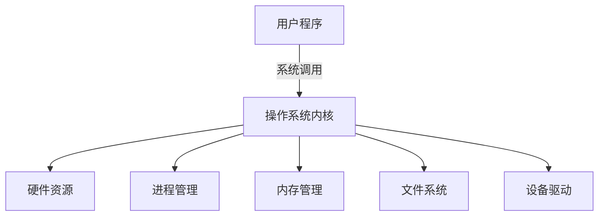
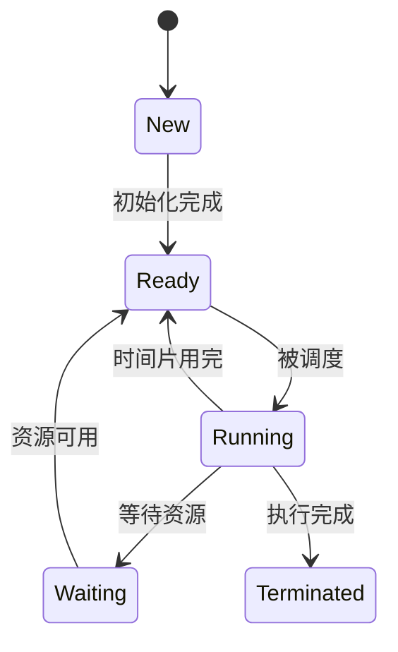

# 操作系统与并发编程综合笔记

## 一、操作系统概述

### 1.1 操作系统定义与功能
- **定义**：管理计算机硬件与软件资源的系统软件
- **核心功能**：
  - 硬件抽象（进程、文件、设备等）
  - 资源管理（CPU、内存、I/O等）
  - 提供用户接口（CLI、GUI）
  - 系统安全与保护

### 1.2 操作系统发展历史
| 代次   | 时期      | 主要特点               |
| ------ | --------- | ---------------------- |
| 第一代 | 1945-1955 | 真空管，无操作系统     |
| 第二代 | 1955-1965 | 晶体管，批处理系统     |
| 第三代 | 1965-1980 | 集成电路，多道程序设计 |
| 第四代 | 1980-至今 | 个人计算机时代         |
| 第五代 | 1990-至今 | 移动计算时代           |

### 1.3 现代操作系统架构


## 二、进程与线程

### 2.1 进程概念
- **PCB结构**：
  ```c
  struct task_struct {
      pid_t pid;          // 进程ID
      state_t state;      // 进程状态
      struct mm_struct *mm; // 内存管理信息
      struct files_struct *files; // 打开文件
      // ...其他字段...
  };
  ```

### 2.2 进程生命周期


### 2.3 线程实现模型
| 模型 | 特点                           | 示例系统   |
| ---- | ------------------------------ | ---------- |
| 1:1  | 每个用户线程对应一个内核线程   | Linux      |
| N:1  | 多个用户线程映射到一个内核线程 | 早期Java   |
| M:N  | 混合模型，灵活映射             | Windows NT |

## 三、并发编程基础

### 3.1 并发问题三大挑战
1. **原子性丧失**：操作被中断导致数据不一致
   ```c
   // 非原子操作示例
   counter++;  // 编译为多条机器指令
   ```

2. **顺序性丧失**：编译器/处理器重排序
   ```c
   // 可能被重排序
   x = 1;
   y = 2;
   ```

3. **全局一致性丧失**：多处理器内存可见性问题

### 3.2 并发控制机制对比

| 机制     | 优点     | 缺点     | 适用场景          |
| -------- | -------- | -------- | ----------------- |
| 互斥锁   | 简单可靠 | 可能死锁 | 一般临界区保护    |
| 条件变量 | 高效等待 | 使用复杂 | 生产者-消费者     |
| 信号量   | 灵活控制 | 容易出错 | 资源池管理(球,袋) |
| 原子操作 | 高性能   | 功能有限 | 计数器等简单操作  |

死锁产生的四个必要条件：需要的资源是互斥的、占有资源并等待更多的资源、不可直接抢别人持有的资源即只有等持有的人主动释放、形成循环等待的环

## 四、同步原语实现

### 4.1 互斥锁实现方案

#### 4.1.1 Peterson算法（软件实现）
```c
// 两线程互斥算法
int flag[2] = {0, 0};
int turn = 0;

void lock(int self) {
    flag[self] = 1;
    turn = 1 - self;
    while (flag[1-self] && turn == 1-self);
}

void unlock(int self) {
    flag[self] = 0;
}
```

#### 4.1.2 硬件原子指令实现
```c
// 使用CAS实现自旋锁
typedef struct {
    int locked;
} spinlock_t;

void spin_lock(spinlock_t *lock) {
    while (__sync_lock_test_and_set(&lock->locked, 1));
}

void spin_unlock(spinlock_t *lock) {
    __sync_lock_release(&lock->locked);
}
```

### 4.2 条件变量实现模式

条件变量实现同步的万能公式：

```c
// 条件变量使用范式
pthread_mutex_t lock;
pthread_cond_t cond;

// 等待方
pthread_mutex_lock(&lock);
while (!condition) {
    pthread_cond_wait(&cond, &lock);
}

// 执行操作

pthread_mutex_unlock(&lock);


// 通知方
pthread_mutex_lock(&lock);
condition = true;
pthread_cond_signal(&cond);
pthread_mutex_unlock(&lock);
```

举例：


```c
#include <stdio.h>
#include <pthread.h>
#include <stdbool.h>
#include <unistd.h>

#define BUFFER_SIZE 5

pthread_mutex_t lock = PTHREAD_MUTEX_INITIALIZER;
pthread_cond_t cond_not_empty = PTHREAD_COND_INITIALIZER;  // 缓冲区非空条件
pthread_cond_t cond_not_full = PTHREAD_COND_INITIALIZER;   // 缓冲区未满条件

int buffer[BUFFER_SIZE];
int count = 0;  // 当前缓冲区中的数据量

void* consumer(void* arg) {
    while (1) {
        pthread_mutex_lock(&lock);
        ​    // 只有缓冲区非空时才能消费
            ​    while (count == 0) {
                ​        printf("Consumer: 缓冲区空，等待...\n");
                ​        pthread_cond_wait(&cond_not_empty, &lock);
                ​    }
        ​    
            ​    // 消费数据
            ​    int item = buffer[--count];
        ​    printf("Consumer: 消费数据 %d (缓冲区剩余: %d)\n", item, count);
        ​    
            ​    // 通知生产者缓冲区未满
            ​    pthread_cond_signal(&cond_not_full);
        ​    pthread_mutex_unlock(&lock);
        ​    
            ​    sleep(1);  // 模拟消费耗时
    }
    return NULL;

}

void* producer(void* arg) {
    int item = 0;
    while (1) {
        pthread_mutex_lock(&lock);
        ​    // 只有缓冲区未满时才能生产
            ​    while (count == BUFFER_SIZE) {
                ​        printf("Producer: 缓冲区满，等待...\n");
                ​        pthread_cond_wait(&cond_not_full, &lock);
                ​    }
        ​    
            ​    // 生产数据
            ​    buffer[count++] = item;
        ​    printf("Producer: 生产数据 %d (缓冲区总量: %d)\n", item++, count);
        ​    
            ​    // 通知消费者缓冲区非空
            ​    pthread_cond_signal(&cond_not_empty);
        ​    pthread_mutex_unlock(&lock);
        ​    
            ​    sleep(1);  // 模拟生产耗时
    }
    return NULL;

}

int main() {
    pthread_t tid1, tid2;
    pthread_create(&tid1, NULL, consumer, NULL);
    pthread_create(&tid2, NULL, producer, NULL);


    pthread_join(tid1, NULL);
    pthread_join(tid2, NULL);

    return 0;

}
```


## 五、进程调度

### 5.1 调度指标对比

| 指标      | 描述               | 优化目标 |
| --------- | ------------------ | -------- |
| CPU利用率 | CPU忙碌时间占比    | 最大化   |
| 吞吐量    | 单位时间完成进程数 | 最大化   |
| 周转时间  | 进程完成总时间     | 最小化   |
| 响应时间  | 请求到首次响应时间 | 最小化   |
| 公平性    | 资源分配公平程度   | 平衡     |

### 5.2 常见调度算法

#### 5.2.1 批处理系统调度
```python
# 短作业优先(SJF)伪代码
def sjf_schedule(processes):
    ready_queue = sorted(processes, key=lambda p: p.estimated_time)
    while ready_queue:
        process = ready_queue.pop(0)
        run(process)
```

#### 5.2.2 交互式系统调度
```python
# 时间片轮转(RR)伪代码
def rr_schedule(processes, time_slice):
    ready_queue = deque(processes)
    while ready_queue:
        process = ready_queue.popleft()
        run(process, time_slice)
        if not process.finished:
            ready_queue.append(process)
```

#### 5.2.3 实时系统调度
```python
# 最早截止时间优先(EDF)伪代码
def edf_schedule(processes):
    ready_queue = sorted(processes, key=lambda p: p.deadline)
    while ready_queue:
        process = ready_queue.pop(0)
        run(process)
```

## 六、进程通信与同步

### 6.1 IPC机制对比

| 机制     | 类型         | 特点             | 适用场景   |
| -------- | ------------ | ---------------- | ---------- |
| 管道     | 单向数据流   | 简单，父子进程间 | 命令行管道 |
| 消息队列 | 结构化消息   | 异步通信         | 分布式系统 |
| 共享内存 | 直接内存访问 | 高效，需同步     | 大数据交换 |
| 信号     | 异步通知     | 轻量级           | 事件通知   |

```c
//管道实现父子进程通信
int main() {
    int pipefd[2];
    pid_t pid;
    char buf;

// 创建管道
if (pipe(pipefd) == -1) {
    perror("pipe");
    exit(EXIT_FAILURE);
}

pid = fork();
if (pid == -1) {
    perror("fork");
    exit(EXIT_FAILURE);
}

if (pid == 0) {
    // 子进程
    close(pipefd[1]); // 关闭写端
    read(pipefd[0], &buf, 1);
    printf("子进程读取到: %c\n", buf);
    close(pipefd[0]); // 关闭读端
    exit(EXIT_SUCCESS);
} else {
    // 父进程
    close(pipefd[0]); // 关闭读端
    write(pipefd[1], "A", 1);
    printf("父进程写入: A\n");
    close(pipefd[1]); // 关闭写端
    wait(NULL); // 等待子进程结束
}

return 0;

}
```


### 6.2 生产者-消费者问题实现

#### 6.2.1 使用信号量
```c
#define BUFFER_SIZE 10

sem_t empty;    // 空槽位
sem_t full;     // 已填充
sem_t mutex;    // 互斥锁

void producer() {
    while (1) {
        item = produce_item();
        sem_wait(&empty);
        sem_wait(&mutex);
        insert_item(item);
        sem_post(&mutex);
        sem_post(&full);
    }
}

void consumer() {
    while (1) {
        sem_wait(&full);
        sem_wait(&mutex);
        item = remove_item();
        sem_post(&mutex);
        sem_post(&empty);
        consume_item(item);
    }
}
```

```c
sem_t mutex; //⽤于互斥的信号量（也可以⽤互斥锁）
sem_init(sem_t &mutex, 0, 1);
sem_t empty; //缓冲区有多少空
sem_init(sem_t &empty, 0, MAX); 
sem_t full; //缓冲区有多少资源
sem_init(sem_t &full, 0, 0);

void produce() { 
 	while(1) { 
 		P(&mutex); 
 		P(&empty); 
 		produce_shared_buffer();
 		V(&full); 
 		V(&mutex);
 	}
}
void consume() { 
 	while(1) { 
 		P(&mutex);
        P(&full); 
 		consume_shared_buffer();
		V(&mutex); 
 		V(&empty); 
 	} 
}
//这里P代表检验，也写作decrease/down/wait/acquire，如果sem的值不是正数就阻塞自己，否则将sem的值减⼀后返回运⾏
//V代表⾃增， 也写作increase/up/post/signal/release，将信号量sem的值加1，如果有⼀个或多个线程阻塞在这个信号量上，选择⼀个唤醒
```


#### 6.2.2 使用条件变量


```c
pthread_mutex_t lock;
pthread_cond_t cond;
int count = 0;
#define MAX 10

void producer() {
    while (1) {
        pthread_mutex_lock(&lock);
        while (count == MAX) {
            pthread_cond_wait(&cond, &lock);
        }
        insert_item();
        count++;
        pthread_cond_signal(&cond);
        pthread_mutex_unlock(&lock);
    }
}

void consumer() {
    while (1) {
        pthread_mutex_lock(&lock);
        while (count == 0) {
            pthread_cond_wait(&cond, &lock);
        }
        remove_item();
        count--;
        pthread_cond_signal(&cond);
        pthread_mutex_unlock(&lock);
    }
}
```

## 七、高级主题

### 7.1 多核调度挑战
- **负载均衡**：
  ```c
  // 负载均衡伪代码
  void load_balance() {
      if (this_cpu.load > threshold) {
          task = find_heaviest_task();
          target_cpu = find_least_loaded_cpu();
          migrate_task(task, this_cpu, target_cpu);
      }
  }
  ```

- **缓存亲和性**：
  ```c
  // 保持任务在相同CPU核心运行
  void set_affinity(pid_t pid, int cpu) {
      cpu_set_t set;
      CPU_ZERO(&set);
      CPU_SET(cpu, &set);
      sched_setaffinity(pid, sizeof(set), &set);
  }
  ```

### 7.2 实时系统调度
- **单调速率分析**：
  ```
  ∑(Ci/Ti) ≤ n(2^(1/n) - 1)
  其中：
  Ci = 任务i的计算时间
  Ti = 任务i的周期
  n = 任务数量
  ```

- **EDF可调度条件**：
  ```
  ∑(Ci/Ti) ≤ 1
  ```

## 八、实践建议

### 8.1 并发编程最佳实践
1. **锁的使用原则**：
   - 保持临界区尽量小
   - 避免嵌套锁
   - 按照固定顺序获取锁
   - 使用锁层次结构

2. **调试技巧**：
   ```bash
   # 使用TSAN检测数据竞争
   gcc -fsanitize=thread -pthread program.c
   ./a.out
   
   # 使用GDB调试多线程
   gdb -p <pid>
   (gdb) info threads
   (gdb) thread <id>
   ```

### 8.2 性能优化方向
- **减少锁竞争**：
  - 使用读写锁
  - 采用无锁数据结构
  - 实现细粒度锁

- **提高并行性**：
  - 任务并行化
  - 数据分区
  - 流水线处理

## 附录：关键系统调用速查表

### 进程管理
| 调用     | 描述           | 参数             | 返回值                           |
| -------- | -------------- | ---------------- | -------------------------------- |
| fork()   | 创建子进程     | 无               | 子进程返回0，父进程返回子进程PID |
| execve() | 执行新程序     | path, argv, envp | 成功不返回，失败返回-1           |
| wait()   | 等待子进程终止 | status指针       | 终止的子进程PID                  |

### 线程控制
| 调用                 | 描述         | 参数                             | 返回值    |
| -------------------- | ------------ | -------------------------------- | --------- |
| pthread_create()     | 创建线程     | thread, attr, start_routine, arg | 成功返回0 |
| pthread_join()       | 等待线程终止 | thread, retval                   | 成功返回0 |
| pthread_mutex_lock() | 获取互斥锁   | mutex                            | 成功返回0 |

### 同步原语
| 调用                | 描述           | 参数                    | 返回值       |
| ------------------- | -------------- | ----------------------- | ------------ |
| sem_init()          | 初始化信号量   | sem, pshared, value     | 成功返回0    |
| pthread_cond_wait() | 等待条件变量   | cond, mutex             | 成功返回0    |
| futex()             | 快速用户态互斥 | uaddr, op, val, timeout | 依赖操作类型 |

## 九、文件系统专题

### 9.1 文件系统核心概念

```
1. 文件组织方式：
   - 连续分配（外部碎片问题）
   - 链表分配（FAT表优化）
   - 索引分配（多级索引）

2. 快速文件系统（FFS）：
   - 柱面组优化局部性
   - 磁盘意识的设计

3. 日志结构文件系统（LFS）：
   - 顺序写入日志
   - 垃圾回收机制
```

### 9.2 文件系统一致性

```
1. fsck检查：
   - 超级块校验
   - inode完整性检查
   - 链接计数验证

2. 日志机制：
   - 预写日志（WAL）
   - 元数据日志（Journaling）
   - 检查点（Checkpoint）
```

## 十、设备管理专题

### 10.1 I/O体系结构

```
1. 设备分类：
   - 块设备（磁盘）：固定大小传输
   - 字符设备（终端）：流式传输

2. 通信方式：
   - 端口映射I/O（in/out指令）
   - 内存映射I/O（MMIO）
```

### 10.2 性能优化技术

```
1. DMA传输：
   - 绕过CPU直接内存访问
   - 减少中断开销

2. 磁盘调度：
   - SSTF（最短寻道优先）
   - 电梯算法（SCAN）
   - 预期调度（Anticipatory）
```
